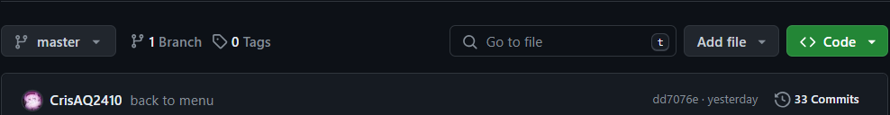
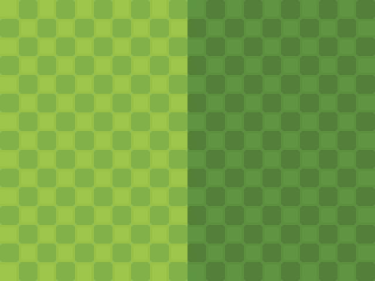
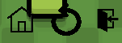
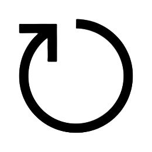
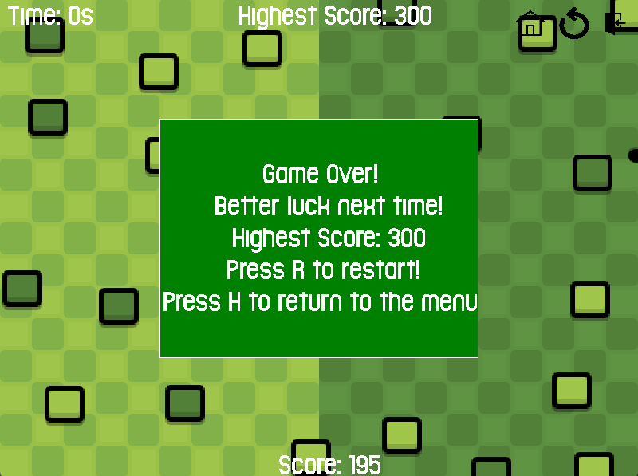

# Golf 2D - 23020696_Chu Anh Quoc
- Thử nghiệm game:
# Giới thiệu game
Golf 2D là một tựa game thể thao. Dựa trên phong cách của bộ môn golf ngoài đời thật, bạn có thể trải nghiệm game một cách thật chill, và đừng quên cố gắng để đạt được điểm số cao nhất. Just chilling!

1. [Cách tải game](#1-cách-tải-game)
2. [Bắt đầu game](#2-bắt-đầu-game)
3. [Các thành phần trong game](#3-các-thành-phần-trong-game)
    - [Địa hình](#31-địa-hình)
    - [Bóng và hố](#32-bóng-và-hố)
    - [Thành phần khác](#33-thành-phần-khác)
4. [Cách chơi](#4-cách-chơi)
5. [Điều kiện kết thúc game](#5-điều-kiện-kết-thúc-game)
6. [Khác](#6-khác) 
    - [Về đồ họa]()
    - [Về source code]()

# 1. Cách tải game
**Bước 1:** Chọn Code -> Download Zip (khoảng 50MB)

   - Có đầy đủ code
   - Có thể chuyển đến bước 5 để chơi luôn nếu đang không sử dụng VSCode

**Bước 2:** Cài mingw. Ở đây mình đang dùng bản [MinGW-W64 GCC-13.2.0](https://sourceforge.net/projects/mingw-w64/files/Toolchains%20targetting%20Win32/Personal%20Builds/mingw-builds/8.1.0/)

**Bước 3:** Vào Extensions của VSCode cài đặt ngôn ngữ C/C++

**Bước 4:** Mở Terminal lên và gõ lệnh:
```
g++ -Isource/include -Lsource/lib -o Golf2D main.cpp mouse_handler.cpp obstacles_random.cpp check_collision.cpp handle_collision.cpp hole_random.cpp check_hole_collision.cpp render_text.cpp restart.cpp power_bar.cpp resources.cpp ball_movement.cpp event_handler.cpp render_game.cpp render_menu.cpp time.cpp -lmingw32 -lSDL2main -lSDL2 -lSDL2_image -lSDL2_mixer -lSDL2_ttf
```
Đợi 1 chút rồi gõ tiếp `./Golf2D` và game sẽ khởi động

**Bước 5:** Mở file Golf2D.exe và chơi

***LƯU Ý:*** Để thực hiện bước 2, 3, 4, khuyến khích các bạn có VSCode ở sẵn trong máy. Nếu không hãy thực hiện luôn bước 5
# 2. Bắt đầu game
Click **chuột trái** để vào chơi game


Người chơi có thể ấn vào **biểu tượng** {width=20} ở góc phải màn hình để thoát game

# 3. Các thành phần trong game
## 3.1. Địa hình
Đơn giản chỉ là một thảm cỏ xanh dựa với các màu lục được phối xen kẽ nhau 

 

Ở trên mặt cỏ sẽ có các khối vật cản  và  xuất hiện ngẫu nhiên với 2 màu chủ đạo là sáng và tối. Tổng có 24 vật cản (mình chọn 24 vì 24 là ngày sinh của mình :v)

## 3.2. Bóng và hố
2 thành phần quan trong không thể thiếu trong một game Golf đó chính là bóng  và hố . Màu trắng, đen sẽ giúp bạn dễ nhận ra chúng hơn khi đặt trên địa hình

## 3.3 Thành phần khác 
Ngoài ra, để game trở nên sinh động hơn, còn có:
   - Thời gian 
   
   - Điểm số ở mỗi map 
   
   - Điểm số cao nhất cho tới khi end game
   
   - Thanh lực 
   
   - Và 1 số icon thao tác:
   

Và đây là bố cục cơ bản của game:


# 4. Cách chơi 
Các bạn chỉ cần điều khiển quả bóng sao cho nó vào hố là ok rồi. Tuy nhiên, nếu số lần kéo của bạn các ít, điểm của bạn sẽ càng cao.

Điểm tối đa ở một map là 200, sau lần kéo thứ nhất sẽ không bị trừ điểm, mỗi lần tiếp theo sẽ bị trừ 5 điểm/lần.

Khi bóng vào lỗ, map sẽ được tự động sắp xếp lại ngẫu nhiên. Nếu bạn may mắn thì có thể bóng sẽ gần hố. Nếu cảm thấy khó quá thì bạn có thể bấm vào biểu tượng {width=20} để load lại map. Thời gian vẫn sẽ giữ nguyên nhưng bạn sẽ bị trừ 100 điểm cho mỗi lần load lại hehe.

Bạn sẽ có thời gian mặc định là 30s, nhưng nếu bóng vào lỗ thì bạn sẽ được cộng thêm 5s. Từ đó, bạn có thể biến nó thành một game vô hạn thời gian.

***Lưu ý:*** Bạn chỉ nên kéo thanh lực ở 1 khoảng ngắn, nếu không lực sẽ không được kiểm soát và quả bóng sẽ .... Để hình dung rõ hơn thì bạn có thể xem thêm ở video mình gắn ở ngay đầu bài.

# 5. Điều kiện kết thúc game
Game sẽ kết thúc nếu như hết thời gian, màn hình sẽ hiện thị như này: 



Lúc này, bạn có thể bấm **H** để quay về màn hình chính hoặc bấm **R** để chơi lại.

# 6. Khác

